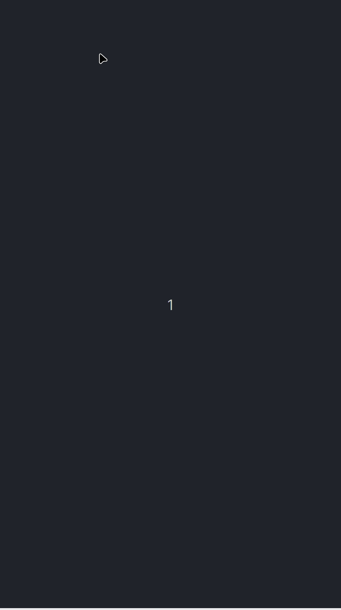
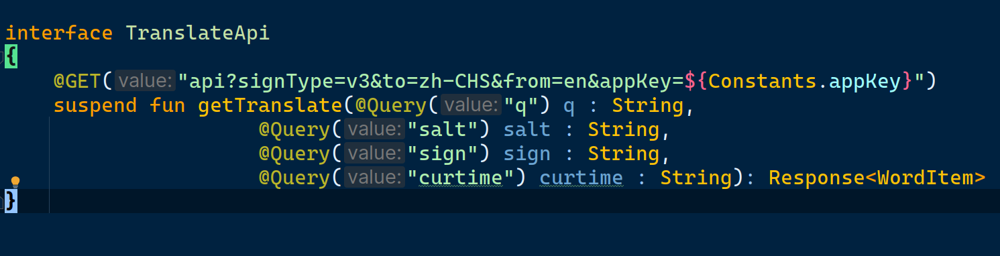
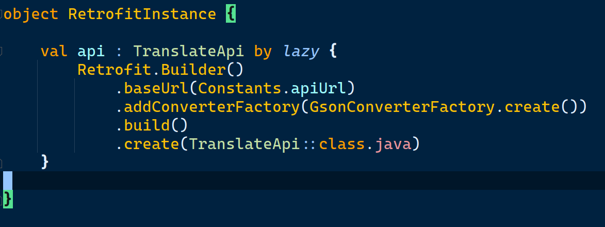
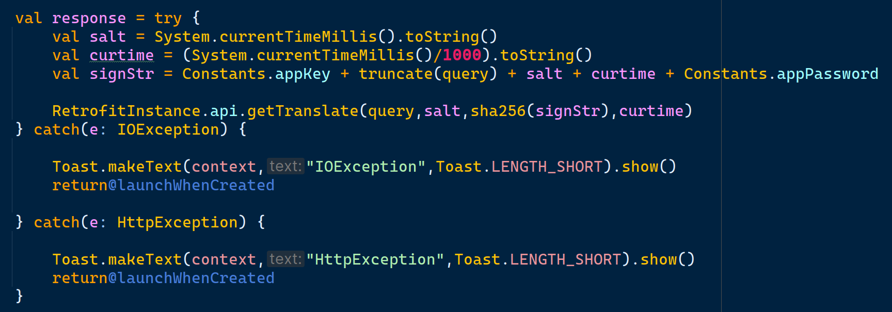

# Android-Translator

An English-To-Chinese Android app built on Youdao latest open API.

- YouDao v3 API documentation : https://ai.youdao.com/DOCSIRMA/html/%E8%87%AA%E7%84%B6%E8%AF%AD%E8%A8%80%E7%BF%BB%E8%AF%91/API%E6%96%87%E6%A1%A3/%E6%96%87%E6%9C%AC%E7%BF%BB%E8%AF%91%E6%9C%8D%E5%8A%A1/%E6%96%87%E6%9C%AC%E7%BF%BB%E8%AF%91%E6%9C%8D%E5%8A%A1-API%E6%96%87%E6%A1%A3.html

- Apply AppKey and AppID here for your own app : https://ai.youdao.com/console/#/ . If you wan to use your own app, just simply change appKey and appPassword in Constants.kt.

# Demo

# Implementation

## API Interface

## Retrofit Instance

## Make real-time request in onQueryTextSubmit

